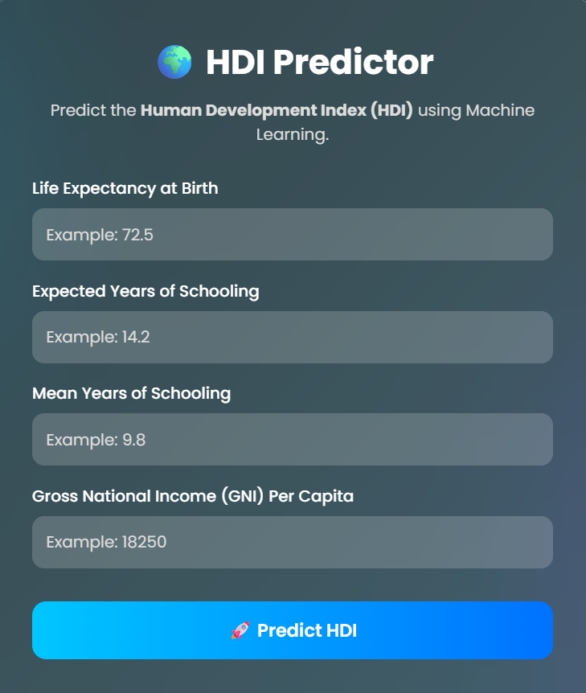
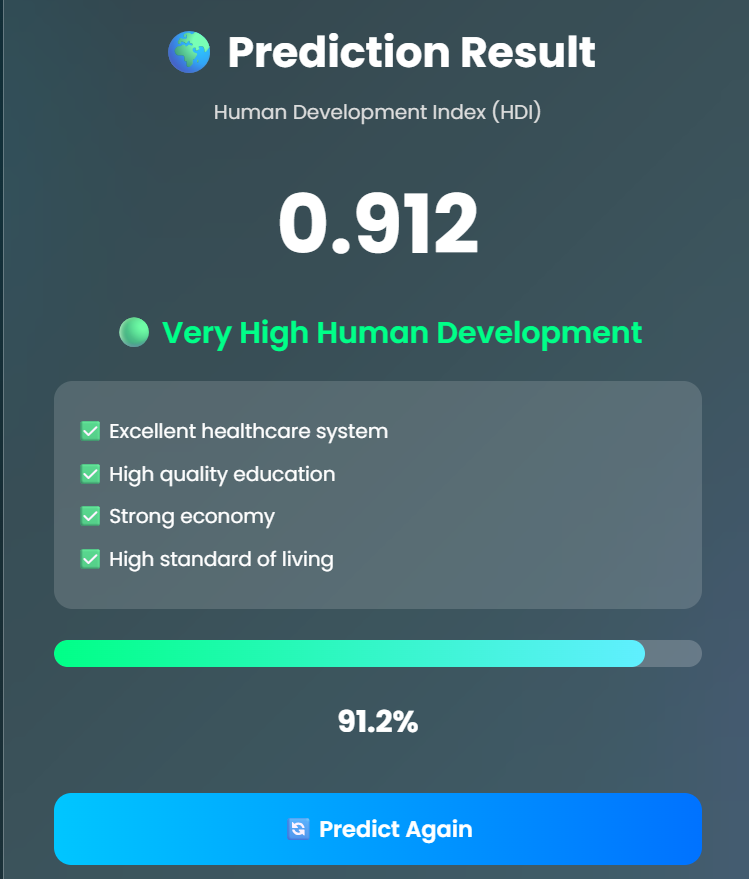
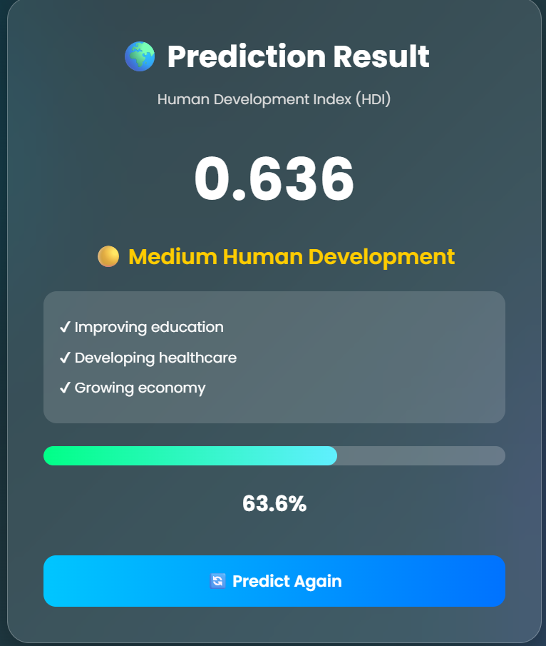

# 🌍 Human Development Index (HDI) Predictor

A Machine Learning web application that predicts the **Human Development Index (HDI)** of a country based on key development indicators such as **Life Expectancy**, **Expected Years of Schooling**, **Mean Years of Schooling**, and **Gross National Income (GNI) Per Capita**.

The project demonstrates the complete Machine Learning workflow—from data preprocessing and visualization to model training and deployment using Flask.

---

## 📌 Project Overview

This application allows users to enter four socio-economic indicators and instantly predicts the Human Development Index (HDI) using a trained Linear Regression model.

---

## 🚀 Features

- 📊 Exploratory Data Analysis (EDA)
- 🧹 Data Cleaning & Preprocessing
- 📈 Correlation Heatmap & Visualizations
- 🤖 Linear Regression Model
- 💾 Model Serialization using Pickle
- 🌐 Flask Web Application
- 📱 Responsive Glassmorphism UI
- 📊 HDI Prediction with Classification
- 🔄 Predict Again Functionality

---

## 🛠️ Tech Stack

- Python
- Pandas
- NumPy
- Matplotlib
- Seaborn
- Scikit-learn
- Flask
- HTML5
- CSS3
- Pickle

---

## 📂 Project Structure

```text
HDI_Predictor/
│
├── dataset/
│   └── hdi_dataset.csv
│
├── models/
│   └── hdi_model.pkl
│
├── notebooks/
│   └── HDI_Analysis.ipynb
│
├── screenshots/
│   ├── home_page.png
│   ├── very_high_prediction.png
│   └── medium_prediction.png
│
├── static/
│   └── css/
│       └── style.css
│
├── templates/
│   ├── index.html
│   └── result.html
│
├── app.py
├── train_model.py
├── requirements.txt
└── README.md
```

---

## 📊 Machine Learning Workflow

1. Load Dataset
2. Data Cleaning
3. Exploratory Data Analysis
4. Feature Selection
5. Train-Test Split
6. Linear Regression Model
7. Model Evaluation
8. Save Model using Pickle
9. Flask Deployment

---

## 📷 Screenshots


### 🏠 Home Page



---

### 📊 Prediction Result (Very High)



---

### 📊 Prediction Result (Medium)




## ⚙️ Installation

Clone the repository:

```bash
git clone https://github.com/your-username/HDI_Predictor.git
```

Navigate to the project folder:

```bash
cd HDI_Predictor
```

Install dependencies:

```bash
pip install -r requirements.txt
```

Run the application:

```bash
python app.py
```

Open your browser:

```
http://127.0.0.1:5000
```

---

## 📈 Model Used

**Linear Regression**

Evaluation Metrics:

- R² Score
- Mean Absolute Error (MAE)
- Mean Squared Error (MSE)
- Root Mean Squared Error (RMSE)

---

## 🎯 Future Improvements

- Random Forest Regressor
- Decision Tree Regressor
- XGBoost Regressor
- Interactive Charts
- User Authentication
- Cloud Deployment

---

## 👩‍💻 Author

**Sushma Boya**

Computer Science Student | Machine Learning Enthusiast | Aspiring Software Developer
